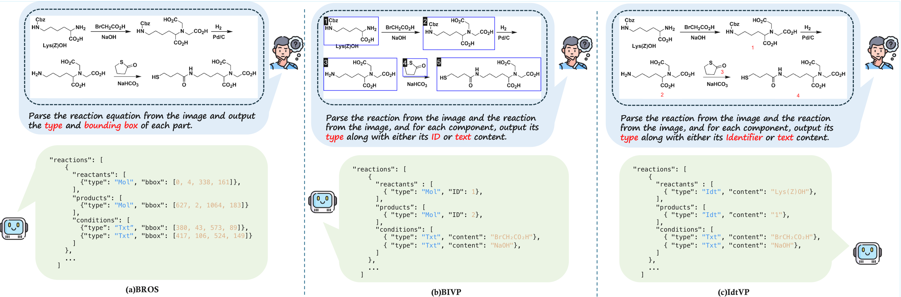

<p align="center">
  
</p>

<h1 align="center"> RxnCaption</h1>

<p align="center">
  <b>Reformulating Reaction Diagram Parsing as Visual Prompt Guided Captioning</b>
</p>

<p align="center">
  <a href="https://arxiv.org/abs/2511.02384"></a>
  <a href="https://huggingface.co/songjhPKU/RxnCaption-VL"></a>
  <a href="https://huggingface.co/datasets/songjhPKU/U-RxnDiagram-15k"></a>
  <a href="LICENSE"></a>
</p>

<p align="center">
  <a href="README_zh.md">🇨🇳 中文文档</a>
</p>

---

> **CVPR 2026** — Given a chemical reaction diagram from a scientific paper, RxnCaption identifies all molecular structures, text labels, and identifiers, then organises them into structured reaction graphs (reactants → conditions → products).

<p align="center">
  
</p>

## 🔥 News

- 🚀 [02/21/2026] Our paper is accepted by **CVPR 2026**!

## ✨ Highlights

- 🏆 **State-of-the-art** on both RxnScribe-test and our U-RxnDiagram-15k benchmark
- 🔬 **Novel BIVP strategy** — Bounding-box Index Visual Prompt turns detection into a structured captioning task
- 🧪 **15k annotated diagrams** — the largest reaction diagram dataset with 4 topology types (single / multiple / tree / graph)
- ⚡ **Plug-and-play** — one script runs the full pipeline: detection → annotation → VL inference
- 📊 **Comprehensive evaluation** — Hard / Soft / Hybrid metrics with visualization reports

## 📊 Main Results

### RxnScribe-test

| Method | Strategy | Hard F1 | Soft F1 |
|--------|----------|---------|---------|
| RxnScribe | BROS | 74.0 | 83.8 |
| RxnIm | BROS | 73.2 | 76.9 |
| Gemini-2.5-Pro | BIVP | 49.8 | 76.1 |
| **RxnCaption-VL (Ours)** | **BIVP** | **75.5** | **88.2** |

### U-RxnDiagram-15k-test

| Method | Strategy | Hard F1 | Soft F1 |
|--------|----------|---------|---------|
| RxnScribe | BROS | 34.9 | 45.9 |
| RxnIm | BROS | 37.4 | 40.5 |
| Gemini-2.5-Pro | BIVP | 40.4 | 66.6 |
| **RxnCaption-VL (Ours)** | **BIVP** | **55.5** | **67.6** |

---

## 🏗️ Repository Structure

```
RxnCaption/
├── README.md / README_zh.md
├── LICENSE                    # Apache-2.0
├── requirements.txt
│
├── molyolo/                   # Module 1 — Molecular structure detector (YOLOv10)
│   ├── predict.py
│   └── weights/MolYOLO.pt     # (download separately)
│
├── rxncaption/                # Module 2/3 — Core pipeline
│   ├── annotate.py            # BIVP: bboxes + reading-order indices
│   ├── inference.py           # VL model inference (prompt templates)
│   └── evaluate.py            # Hard / Soft / Hybrid evaluation
│
├── tools/                     # Data processing utilities
│   ├── generate_mapdict.py
│   ├── transform_yolo_detections.py
│   ├── convert_to_qwen_format.py
│   ├── transform_jsonl_to_json.py
│   └── transform_prediction_to_gtformat.py
│
├── scripts/                   # Shell pipelines
│   ├── run_inference.sh       # End-to-end inference
│   ├── run_eval.sh            # Evaluation
│   └── prepare_data.sh        # Training data preparation
│
├── demo/                      # Quick demo with sample images
│   ├── run_demo.sh
│   └── run_demo_slurm.sh
│
└── docs/
    ├── DATA.md                # Dataset documentation
    └── TRAINING.md            # Training guide
```

---

## ⚡ Quick Start

### Installation

```bash
git clone https://github.com/songjhPKU/RxnCaption
cd RxnCaption
pip install -r requirements.txt

# Install the bundled ultralytics (YOLOv10) fork
pip install -e molyolo/
```

### Download Weights

```bash
# MolYOLO detector checkpoint
mkdir -p molyolo/weights
wget -O molyolo/weights/MolYOLO.pt \
    https://github.com/songjhPKU/MolYOLO/raw/main/weights/MolYOLO.pt

# RxnCaption-VL model — two options:
# Option A: Auto-download from HuggingFace (default)
#   The scripts use "songjhPKU/RxnCaption-VL" by default.
#   swift will download it automatically on first run.

# Option B: Use a local copy (recommended for most users)
huggingface-cli download songjhPKU/RxnCaption-VL --local-dir /path/to/RxnCaption-VL
#   Then pass the local path via --model:
#   bash scripts/run_inference.sh --model /path/to/RxnCaption-VL ...
```

### Run Inference on Your Images

```bash
bash scripts/run_inference.sh \
    --image_dir  /path/to/reaction_images \
    --output_dir ./outputs \
    --gpu_num    1
```

This runs the full pipeline:
1. **MolYOLO** detects molecular structures → per-image JSON bboxes
2. **BIVP** annotates images with blue boxes + numeric labels
3. **RxnCaption-VL** reads the annotated images and predicts reaction graphs
4. Post-processing converts the output to evaluation format

### Quick Demo

Want to try it out quickly? Use the bundled demo script:

```bash
# 1. Put a few reaction images into demo/sample_images/
# 2. Run:
bash demo/run_demo.sh

# With evaluation (if you have ground truth):
GT_FILE=demo/sample_gt.json bash demo/run_demo.sh

# With a local model checkpoint:
MODEL=/path/to/RxnCaption-VL bash demo/run_demo.sh
```

See [demo/README.md](demo/README.md) for full details.

---

## 🔬 Pipeline Details

### Step 1 — MolYOLO Detection

A fine-tuned YOLOv10 model detects all relevant entities (molecules, text, identifiers) in each reaction diagram image.

```bash
python molyolo/predict.py \
    --img_dir       /path/to/images \
    --weights       molyolo/weights/MolYOLO.pt \
    --output_dir    outputs/molyolo \
    --output_name   run01 \
    --conf          0.5 \
    --gpu_num       4 \
    --visual_prompt
```

### Step 2 — BIVP Annotation

The **Bounding-box Index Visual Prompt** (BIVP) module draws blue bounding boxes and reading-order numeric labels onto each image, turning raw detections into a visual prompt for the VL model.

```bash
python rxncaption/annotate.py \
    --image_root_dir    /path/to/images \
    --det_json_root_dir outputs/molyolo/run01/json \
    --middle_root_dir   outputs/annotated \
    --confidence_threshold 0.5
```

### Step 3 — RxnCaption-VL Inference

The fine-tuned Qwen2.5-VL-7B model reads each annotated image and outputs a structured JSON reaction list.

```bash
swift infer \
    --model           songjhPKU/RxnCaption-VL \
    --model_type      qwen2_5_vl \
    --infer_backend   pt \
    --val_dataset     outputs/eval_input.jsonl \
    --result_path     outputs/infer_output.jsonl \
    --max_batch_size  1 \
    --max_new_tokens  16384
```

**Example output:**
```json
[
  {
    "reactants":  [{"structure": 1}, {"text": "H₂O"}],
    "conditions": [{"text": "Δ, 2h"}],
    "products":   [{"structure": 2}]
  }
]
```

### Step 4 — Evaluation

Three evaluation modes reflect different levels of matching strictness:

| Mode | What is matched |
|------|-----------------|
| **Hard** | All role members (molecules + text) must match with IoU ≥ 0.5 |
| **Soft** | Only molecule members are compared |
| **Hybrid** | Molecules matched by IoU; text compared as unordered bag |

```bash
bash scripts/run_eval.sh \
    --gt_file        data/ground_truth.json \
    --raw_pred_file  outputs/raw_prediction.json \
    --mapdict        data/mapdict_from_yolo_to_gt.json \
    --image_dir      data/images \
    --output_dir     results/ \
    --mode           all
```

---

## 🗃️ Dataset

**U-RxnDiagram-15k** contains ~15,000 reaction diagram images from scientific PDFs with full annotation across 4 topology types.

```python
from datasets import load_dataset
ds = load_dataset("songjhPKU/U-RxnDiagram-15k")
```

See [docs/DATA.md](docs/DATA.md) for the complete schema and download instructions.

---

## 🏋️ Training

See [docs/TRAINING.md](docs/TRAINING.md) for the full training guide.

Short version:

```bash
# 1. Prepare data
bash scripts/prepare_data.sh \
    --raw_gt_json  data/ground_truth_ocr.json \
    --yolo_det_dir data/det_json/ \
    --image_dir    data/annotated_images/ \
    --output_dir   data/processed/

# 2. Train (8 GPUs, full fine-tuning)
swift sft \
    --model Qwen/Qwen2.5-VL-7B-Instruct \
    --model_type qwen2_5_vl \
    --dataset data/processed/train.jsonl \
    --val_dataset data/processed/val.jsonl \
    --output_dir outputs/train/ \
    # ... see docs/TRAINING.md for full args
```

---

## 🤝 Citation

If you find this work helpful, please cite:

```bibtex
@misc{song2026rxncaptionreformulatingreactiondiagram,
      title={RxnCaption: Reformulating Reaction Diagram Parsing as Visual Prompt Guided Captioning}, 
      author={Jiahe Song and Chuang Wang and Bowen Jiang and Yinfan Wang and Hao Zheng and Xingjian Wei and Chengjin Liu and Rui Nie and Junyuan Gao and Jiaxing Sun and Yubin Wang and Lijun Wu and Zhenhua Huang and Jiang Wu and Qian Yu and Conghui He},
      year={2026},
      eprint={2511.02384},
      archivePrefix={arXiv},
      primaryClass={cs.CV},
      url={https://arxiv.org/abs/2511.02384}, 
}
```

---

## 📜 License

This project is licensed under the **CC BY-NC 4.0** license — see [LICENSE](LICENSE) for details.

## 🙏 Acknowledgements

This research is supported by Shanghai AI Laboratory.
